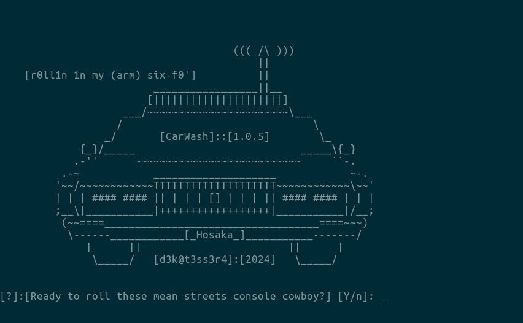
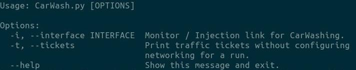

# [CarWash]:
**WARNING:** Mostly untested beyond raspbian.  I will continue fixing and developing as time goes. Bear with me, I have a passion for scripting and for radio hacking,
but I am learning python with this project more or less. 



**[What is it]:**

Research/RedTeamers tool to automate the Wash>Reaver(pixiedust)>* workflow with cyberpunk themed output. It's Fun. I'm old-school and love aesthetic, interactive console tools. 

**[How does it]:**

CarWash prompts for operator readiness then checks the available interfaces and prompts for a choice. It then stops dhcpcd, removes all rfkill blockages, uses airmon-ng to put the selected interface in monitor mode, spoofing the interfaces MAC address. CarWash then runs the t6x fork of Wash to scan for WPS enabled AP's and sorts them by signal strength. Next these AP's are attacked in order of signal strength with the ability for the operator to skip through the list. It logs pwned AP's and prints them when done running the sorted list. It then prompts for restart. If restart is denied by operator, it prompts to reset network config and adapter mode. If operator confirms CarWash will reset dhcpcd and restore the adapter from monitor mode, then prompt operator to launch another tool, likely a post connection tool like bettercap, while exiting CarWash. 

**[Requires it]:**

[macchanger](https://github.com/alobbs/macchanger)
```
sudo apt update && sudo apt install macchanger
```


[aircrack-ng](https://github.com/aircrack-ng/aircrack-ng)
  ```
  sudo apt updte && sudo apt install aircrack-ng

  ```

[t6x Reaver](https://github.com/t6x/reaver-wps-fork-t6x)
  ```
  git clone https://github.com/t6x/reaver-wps-fork-t6x.git
  cd reaver-wps-fork-t6x*
  cd src
  ./configure
  make
  sudo make install
  ```


**[Install it]:**
  ```
  git clone https://github.com/d3k4-k3rb3r0s/CarWash.git
  sudo bash setup.sh
  ```
**[Use it]:**
  ```
  sudo Carwash [options]
  ```



## [Changes]
### [CarWash]:[v]:[1.0.2]
  - Added the  -t--TICKETS` flag to print "traffic tickets" without actually engaging monitor mode or killing dhcpcd.service et cetera. This way, the traffic tickets 
    (WPS PIN & WPA PSK) list can be referenced for further work, with less hassle.
  - Added the `reset_network_configuration` function, to reverse the monitor mode and config setup in `set_monitor_mode`. This enables the operator to finish the session with original system conditions restored for a fresh start.
  - Added the `open_tool` function to provide the opton to the user after restting the interfaces and network settings, to open another tool for further work. I decided to ship this function with only bettercap configured due to aliasing and /path issues I don't want to tackle at the moment.  The list can be further configured by the end user with the supplied template.
  - Random miscellaneus typos and grammar errors fixed as well as output formatting and modification/update of the ascii CarWash image.
### [CarWash]:[v]:[1.0.3]
  - Fixed the issue with all AP rows from `traffic_report.csv` being written to `traffic_tickets.csv`.
  - Fixed the error with the --help call.
  - Random miscellaneus typos and grammar errors fixed as well as output formatting and modification/update of the ascii CarWash image.
### [CarWash]:[v]:[1.0.4]
  - Re-arranged some things and included `__init__.py`, a `CarWash` subdirectory for it, et cetera for python packaging purposes.
  - Added `setup.py` to handle python packaging. PLease report any errors as I have a limited ability/desire to test install across various systems. Isssues and pull requests welcome.
  - Added `setup.sh`, an interactive BASh script to walk you through setting up system dependencies for the tools CarWash uses. Please report any errors as I have a limited ability/desire to test install across various systems. Isssues and pull requests welcome.
  - Updated install instructions to reflect these changes.
  - Random miscellaneus typos and grammar errors fixed as well as output formatting and modification/update of the ascii CarWash image.
### [CarWash]:[v]:[1.0.5]
  - Updated the `-t--TICKETS` flag to print the tickets, then run the `open_tool` function to improve efficincy and workflow.
  - Fixed the bug with the `subprocess.run` commands in `open_tool`.
  - Finally added a macchanger process to the `netw_iface_cofig` function, to ensure a new MAC address for the interface, everytime CarWash starts.
  - 
  - Random miscellaneus typos and grammar errors fixed as well as output formatting and modification/update of the ascii CarWash image.
     - Including variable to output the operators hostname. 


## [To Do Lists]

### [Essential]:
 - Add config file to manipulate default interfaces, timeouts, and maybe some other things.
 - Fix "traffic_report.csv" write format. (currently writes all data to one column of csv.)
 - Add GPS functionality.
 - Add option to convert traffic_tickets.csv" to a google-mappable KML file.
  
### [Nice Ideas]:
 - Add the functionality of choosing which AP's from the list to attack, and then transfer the harvested WPS PIN & WPA PSK to another tool for immediate use, CarWash is 
   designed to be like a war-driving tool. It isn't meant to be used for tightly targeted precision attacks. So this may actually become a separate but related tool.
 - Add option flags to pass certain reaver and wash flags, making it more versatile.
 - Write a smaller version that can run headless, or with a pwnagotchi style display & pimoroni button shim.


## [Other Stuff]

### [p0st-w4sh]
 - Included is a script I called `p0st-w4sh` that was my BASh workaround, when I couldn't get the reset function added in CarWash:1.0.2 to work. Feel free to use it or       not, for me, BASh is home, and python is experimental and being learned. It took me 10 minutes to write p0st-w4sh, whereas at that point I had spent a week trying to      fix one python function.
 - I'm leaving it here as an artifact. Maybe it helps you in some way. I can be used after any tool you use that mangles the network config to run, to fix it and drop you    into any from a list of tools of your choice. 
 - If you're interested see the commented sections of the script to confgure it for your own use.

### [Thanks]
- `Craig Heffner` , for the tools. and being willing to communicate with me about them. 
- `wiire` , for the tools.
- `t6x` , for the tools.
- `alobbs` for macchanger
- Everyone who said "WPS is dead, why even bother?!" for confirming that disregarding "common knowledge" and probing the facts, is an essential aspect of a hackers mentality.


### [hack.the.planet]:[d3k@t3ss3r4]
[disclaimer]: Don't do anything I would use as an excuse to spank your mom.
